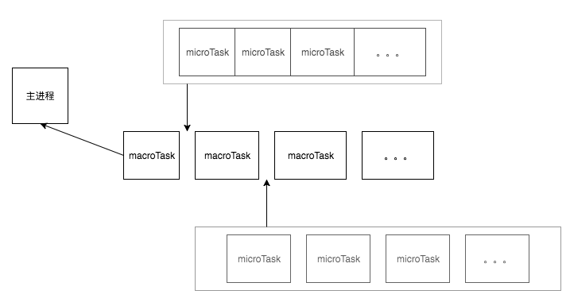

## 单进程和非阻塞

我们都知道，javascript从诞生之日起就是一门单线程的非阻塞的脚本语言。

单线程意味着，javascript代码在执行的任何时候，都只有一个主线程来处理所有的任务，也就是说，同一个时间只能做一件事。

而非阻塞则是当代码需要进行一项异步任务（无法立刻返回结果，需要花一定时间才能返回的任务，如I/O事件）的时候，主线程会挂起（pending）这个任务，然后在异步任务返回结果的时候再根据一定规则去执行相应的回调。

单线程是必要的，也是javascript这门语言的基石，原因之一在其最初也是最主要的执行环境——浏览器中，我们需要进行各种各样的dom操作，单线程可以避免DOM 渲染的冲突 。试想一下 如果javascript是多线程的，那么当两个线程同时对dom进行一项操作，例如一个向其添加事件，而另一个删除了这个dom，此时该如何处理呢？因此，为了保证不会 发生类似于这个例子中的情景，javascript选择只用一个主线程来执行代码，这样就保证了程序执行的一致性。

当然，现如今人们也意识到，单线程在保证了执行顺序的同时也限制了javascript的效率，因此为了利用多核CPU的计算能力，HTML5提出Web Worker标准，允许JavaScript脚本创建多个线程， 但是子线程完全受主线程控制，且不得操作DOM。其只能为主线程分担一些诸如计算等任务。所以，这个新标准并没有改变JavaScript单线程的本质。 

话说回来，前面提到javascript的另一个特点是“非阻塞”，那么javascript引擎到底是如何实现的这一点呢？答案就是今天这篇文章的主角——event loop（事件循环）。

## 事件循环

根据 [HTML 规范](https://link.juejin.im/?target=https%3A%2F%2Fwww.w3.org%2FTR%2Fhtml5%2Fwebappapis.html%23event-loops)：

> To coordinate events, user interaction, scripts, rendering, networking, and so forth, user agents must use event loops as described in this section. There are two kinds of event loops: those for **browsing contexts**, and those for **workers**.

为了**协调事件、用户交互、脚本、UI 渲染和网络处理等行为，防止主线程的不阻塞**，Event Loop 的方案应用而生。Event Loop 包含两类：一类是基于 [Browsing Context](https://link.juejin.im/?target=https%3A%2F%2Fwww.w3.org%2FTR%2Fhtml5%2Fbrowsers.html%23browsing-context)，一种是基于 [Worker](https://link.juejin.im/?target=https%3A%2F%2Fwww.w3.org%2FTR%2Fworkers%2F%23worker)。二者的运行是独立的，也就是说，每一个JavaScript 运行的"线程环境"都有一个独立的 Event Loop，每一个 Web Worker 也有一个独立的Event Loop。

> 注：本文所涉及到的事件循环是基于 Browsing Context。

那么在事件循环机制中，又通过什么方式进行函数调用或者任务的调度呢？

## 任务队列

根据规范，事件循环是通过[任务队列](https://link.juejin.im/?target=https%3A%2F%2Fwww.w3.org%2FTR%2Fhtml5%2Fwebappapis.html%23task-queues)的机制来进行协调的。一个 Event Loop 中，可以有一个或者多个任务队列(task queue)，一个任务队列便是一系列有序任务(task)的集合；每个任务都有一个任务源(task source)，源自同一个任务源的 task 必须放到同一个任务队列，从不同源来的则被添加到不同队列。

在事件循环中，每进行一次循环操作称为 tick，每一次 tick 的任务[处理模型](https://link.juejin.im/?target=https%3A%2F%2Fwww.w3.org%2FTR%2Fhtml5%2Fwebappapis.html%23event-loops-processing-model)是比较复杂的，但关键步骤如下：

- 在此次 tick 中选择最先进入队列的任务(oldest task或者说是macroTask)，如果有则执行(一次)
- 检查是否存在 Microtasks，如果存在则不停地执行，直至清空 Microtasks Queue
- 更新 render
- 主线程重复执行上述步骤

仔细查阅规范可知，异步任务可分为 `task` 和 `microtask` 两类，不同的API注册的异步任务会依次进入自身对应的队列中，然后等待 Event Loop 将它们依次压入执行栈中执行。

> 注：网上比较多关于事件循环介绍的文章均会提到 macrotask(宏任务) 和 microtask(微任务) 两个概念，但规范中并没有提到 macrotask，因而一个比较合理的解释是 task 即为其它文章中的 macrotask。另外ES2015 规范中称为 microtask 又被称为 Job。

(macro)task（宏任务）和microtask（微任务）具体分类如下：

- (macro)task主要包含：script(整体代码)、setTimeout、setInterval、I/O、UI交互事件（UI rendering）、setImmediate(Node.js 环境)、requestAnimationFrame

- microtask主要包含：Promise、process.nextTick(Node.js 环境)、MutaionObserver、Object.observe

> 注：process.nextTick方法可以在当前"执行栈"的尾部----下一次Event Loop（主线程读取"任务队列"）之前----触发回调函数。也就是说，在 Node 中，会优先清空 next tick queue，即通过process.nextTick 注册的函数，再清空 other queue，常见的如Promise，process.nextTick方法指定的任务总是发生在所有异步任务之前。
>
> setImmediate方法则是在当前"任务队列"的尾部添加事件，也就是说，它指定的任务总是在下一次Event Loop时执行，这与setTimeout(fn, 0)很像。

setTimeout/Promise 等API便是任务源，而进入任务队列的是他们指定的具体执行任务。来自不同任务源的任务会进入到不同的任务队列。其中setTimeout与setInterval是同源的。

给一张javascript中的事件循环简图：

## 实例

我们来分析一段较为复杂的代码，来感受一下js的运行机制：

~~~
console.log('1');

setTimeout(function() {
    console.log('2');
    process.nextTick(function() {
        console.log('3');
    })
    new Promise(function(resolve) {
        console.log('4');
        resolve();
    }).then(function() {
        console.log('5')
    })
})
process.nextTick(function() {
    console.log('6');
})
new Promise(function(resolve) {
    console.log('7');
    resolve();
}).then(function() {
    console.log('8')
})

setTimeout(function() {
    console.log('9');
    process.nextTick(function() {
        console.log('10');
    })
    new Promise(function(resolve) {
        console.log('11');
        resolve();
    }).then(function() {
        console.log('12')
    })
})
~~~

第一轮事件循环流程分析如下：

- 整体script作为第一个宏任务进入主线程，遇到`console.log`，输出1。
- 遇到`setTimeout`，其回调函数被分发到宏任务Event Queue中。我们暂且记为`setTimeout1`。
- 遇到`process.nextTick()`，其回调函数被分发到微任务Event Queue中。我们记为`process1`。
- 遇到`Promise`，`new Promise`直接执行，输出7。`then`被分发到微任务Event Queue中。我们记为`then1`。
- 又遇到了`setTimeout`，其回调函数被分发到宏任务Event Queue中，我们记为`setTimeout2`。

| 宏任务Event Queue | 微任务Event Queue |
| :---------------: | :---------------: |
|    setTimeout1    |     process1      |
|    setTimeout2    |       then1       |

- 上表是第一轮事件循环宏任务结束时各Event Queue的情况，此时已经输出了1和7。
- 我们发现了`process1`和`then1`两个微任务。
- 执行`process1`,输出6。
- 执行`then1`，输出8。

好了，第一轮事件循环正式结束，这一轮的结果是输出1，7，6，8。那么第二轮时间循环从`setTimeout1`宏任务开始：

- 首先输出2。接下来遇到了`process.nextTick()`，同样将其分发到微任务Event Queue中，记为`process2`。`new Promise`立即执行输出4，`then`也分发到微任务Event Queue中，记为`then2`。

| 宏任务Event Queue | 微任务Event Queue |
| :---------------: | :---------------: |
|    setTimeout2    |     process2      |
|                   |       then2       |

- 第二轮事件循环宏任务结束，我们发现有`process2`和`then2`两个微任务可以执行。
- 输出3。
- 输出5。
- 第二轮事件循环结束，第二轮输出2，4，3，5。
- 第三轮事件循环开始，此时只剩setTimeout2了，执行。
- 直接输出9。
- 将`process.nextTick()`分发到微任务Event Queue中。记为`process3`。
- 直接执行`new Promise`，输出11。
- 将`then`分发到微任务Event Queue中，记为`then3`。

| 宏任务Event Queue | 微任务Event Queue |
| :---------------: | :---------------: |
|                   |     process3      |
|                   |       then3       |

- 第三轮事件循环宏任务执行结束，执行两个微任务`process3`和`then3`。
- 输出10。
- 输出12。
- 第三轮事件循环结束，第三轮输出9，11，10，12。

整段代码，共进行了三次事件循环，完整的输出为1，7，6，8，2，4，3，5，9，11，10，12。 (请注意，node环境下的事件监听依赖libuv与前端环境不完全相同，输出顺序可能会有误差)

## 总结

- javascript是一门单线程非阻塞语言
- javascript中的Event Loop事件循环是通过[任务队列](https://link.juejin.im/?target=https%3A%2F%2Fwww.w3.org%2FTR%2Fhtml5%2Fwebappapis.html%23task-queues)的机制来进行协调的，包含同步任务和异步任务
- 异步任务又可分为(macro)task（宏任务）和microtask（微任务）
- 一次事件循环：先运行`macroTask`队列中的一个，然后运行`microTask`队列中的所有任务，更新 render。接着开始下一次循环（只是针对macroTask和microTask，一次完整的事件循环会比这个复杂的多）。 
- 常见的异步任务有：setTimeout和setInterval，Dom事件，Promise，Ajax请求

**参考资料：**

[JavaScript 运行机制详解：再谈Event Loop](http://www.ruanyifeng.com/blog/2014/10/event-loop.html)

[这一次，彻底弄懂 JavaScript 执行机制](https://juejin.im/post/59e85eebf265da430d571f89)

[从一道题浅说 JavaScript 的事件循环](https://juejin.im/entry/5a8bc3215188257a856f4b2b)

[总是一只半解的 Event Loop](https://sunyuhui.com/2017/05/26/event-loop/)

[详解JavaScript中的Event Loop（事件循环）机制](https://zhuanlan.zhihu.com/p/33058983)