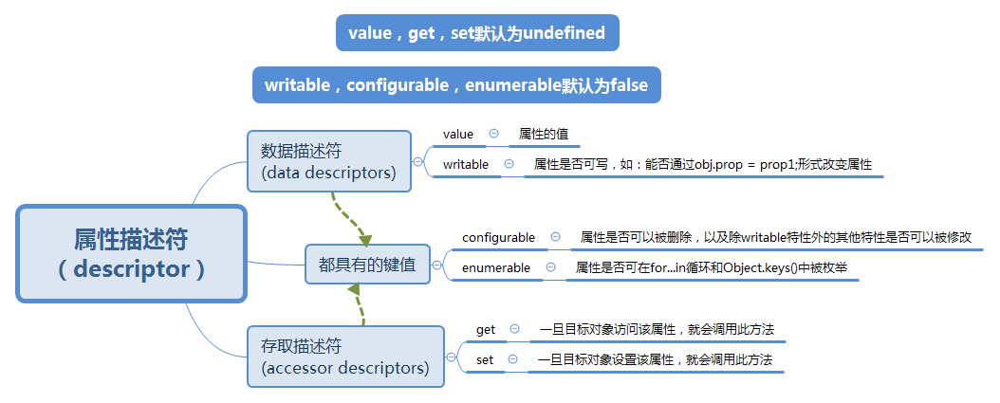

## Object.defineProperty()

### 定义

**Object.defineProperty** ，顾名思义，**为对象定义属性**。在js中我们可以通过下面这几种方法定义属性：

```
// 方法一： 使用点运算符
someOne.name = 'cover';
// 方法二：使用方括号
someOne['name'] = 'cover';
// 方法三：使用 Object.defineProperty()
Object.defineProperty(someOne, 'name', {
    value : 'cover'
})
```

从上面看，貌似使用Object.defineProperty()方法很麻烦，那这个方法存在的意义是什么呢？

我们来看下 Object.defineProperty的定义：

> The Object.defineProperty() method defines a new property directly on an object, or modifies an exisiting property on an object, and returns the object. 

有上面的定义可知：该方法会直接在一个对象上定义一个新属性，或者修改一个对象的现有属性， 并返回这个对象。 

### 语法

```
Object.defineProperty(obj, prop, descriptor)
```

**参数：**

obj：要在其上定义属性的对象。 

prop：要定义或修改的属性的名称。 

descriptor：将被定义或修改的属性描述符。 

**返回值：**

被传递给函数的对象。 

### 属性描述符

对象里目前存在的属性描述符有两种主要形式：**数据描述符**（data descriptors）和**存取描述符**（accessor descriptors）。**数据描述符**是一个具有值的属性，该值可能是可写的，也可能不是可写的。**存取描述符**是由getter-setter函数对描述的属性。描述符必须是这两种形式之一；不能同时是两者。 

将属性描述符分类及其键值含义用思维导图形式总结如下：



**注意：**如果一个描述符不具有value,writable,get 和 set 任意一个关键字，那么它将被认为是一个数据描述符。如果一个描述符同时有(value或writable)和(get或set)关键字，将会产生一个异常。 

这些选项不一定是自身属性，如果是继承来的也要考虑。为了确认保留这些默认值，你可能要在这之前冻结 `Object.prototype`，明确指定所有的选项，或者将`__proto__`属性指向`null`。 

```
// 使用 __proto__
var obj = {};
var descriptor = Object.create(null); // 没有继承的属性
// 默认没有 enumerable，没有 configurable，没有 writable
descriptor.value = 'static';
Object.defineProperty(obj, 'key', descriptor);

// 显式
Object.defineProperty(obj, "key", {
  enumerable: false,
  configurable: false,
  writable: false,
  value: "static"
});

// 循环使用同一对象
function withValue(value) {
  var d = withValue.d || (
    withValue.d = {
      enumerable: false,
      writable: false,
      configurable: false,
      value: null
    }
  );
  d.value = value;
  return d;
}
// ... 并且 ...
Object.defineProperty(obj, "key", withValue("static"));

// 如果 freeze 可用, 防止代码添加或删除对象原型的属性
// （value, get, set, enumerable, writable, configurable）
(Object.freeze||Object)(Object.prototype);
```

### 创建属性

例子：

```
var o = {}; // 创建一个新对象

// 在对象中添加一个属性与数据描述符的示例
Object.defineProperty(o, "a", {
  value : 37,
  writable : true,
  enumerable : true,
  configurable : true
});

// 对象o拥有了属性a，值为37

// 在对象中添加一个属性与存取描述符的示例
var bValue;
Object.defineProperty(o, "b", {
  get : function(){
    return bValue;
  },
  set : function(newValue){
    bValue = newValue;
  },
  enumerable : true,
  configurable : true
});

o.b = 38;
// 对象o拥有了属性b，值为38

// o.b的值现在总是与bValue相同，除非重新定义o.b

// 数据描述符和存取描述符不能混合使用
Object.defineProperty(o, "conflict", {
  value: 0x9f91102, 
  get: function() { 
    return 0xdeadbeef; 
  } 
});
// throws a TypeError: value appears only in data descriptors, get appears only in accessor descriptors
```

### 修改属性

如果属性已经存在，`Object.defineProperty()`将尝试根据描述符中的值以及对象当前的配置来修改这个属性。如果旧描述符将其`configurable` 属性设置为`false`，则该属性被认为是“不可配置的”，并且没有属性可以被改变（除了单向改变 writable 为 false）。当属性不可配置时，不能在数据和访问器属性类型之间切换。

当试图改变不可配置属性（除了`writable` 属性之外）的值时会抛出{jsxref("TypeError")}}，除非当前值和新值相同。

### 添加多个属性和默认值

考虑特性被赋予的默认特性值非常重要，通常，使用点运算符和`Object.defineProperty()`为对象的属性赋值时，数据描述符中的属性默认值是不同的：

点运算符：拥有布尔值的字段的默认值都是`true`；

`Object.defineProperty()`：拥有布尔值的字段的默认值是`false` 。

如下例所示。 

```
var o = {};

o.a = 1;
// 等同于 :
Object.defineProperty(o, "a", {
  value : 1,
  writable : true,
  configurable : true,
  enumerable : true
});


// 另一方面，
Object.defineProperty(o, "a", { value : 1 });
// 等同于 :
Object.defineProperty(o, "a", {
  value : 1,
  writable : false,
  configurable : false,
  enumerable : false
});
```

### 视图和数据的联动

给对象o定义新的属性b，并且定义属性b的get和set方法，当o.b的时候会调用b属性的get方法，给b属性赋值的时候，会调用set方法，这就是修改数据的时候，视图会自动更新的关键。

前端获取数据后，需要根据数据操作dom，视图变化后，需要修改不少代码，使用Object.defineProperty()方法可以将数据和dom操作隔离，看一个例子：

显示用户信息的html模版 

```
<div>
    <p>你好，<span id='nickName'></span></p>
    <div id="introduce"></div>
</div>　
```

设置一个数据的属性的getter和setter 

```
//视图控制器
var userInfo = {};
Object.defineProperty(userInfo, "nickName", {
    get: function(){
        return document.getElementById('nickName').innerHTML;
    },
    set: function(nick){
        document.getElementById('nickName').innerHTML = nick;
    }
});
Object.defineProperty(userInfo, "introduce", {
    get: function(){
        return document.getElementById('introduce').innerHTML;
    },
    set: function(introduce){
        document.getElementById('introduce').innerHTML = introduce;
    }
})
```

```
//数据
//todo 获取用户信息的代码
....
userInfo.nickName = "xxx";
userInfo.introduce = "我是xxx，我来自云南，..."
```

设置userInfo的nickName属性时会调用set方法，更新dom节点的html 。

### 一般的Setters和Getters

下面的例子展示了如何实现一个自存档对象。 当设置`temperature` 属性时，`archive` 数组会获取日志条目。 

```
function Archiver() {
  var temperature = null;
  var archive = [];

  Object.defineProperty(this, 'temperature', {
    get: function() {
      console.log('get!');
      return temperature;
    },
    set: function(value) {
      temperature = value;
      archive.push({ val: temperature });
    }
  });

  this.getArchive = function() { return archive; };
}

var arc = new Archiver();
arc.temperature; // 'get!'
arc.temperature = 11;
arc.temperature = 13;
arc.getArchive(); // [{ val: 11 }, { val: 13 }]
```

或

```
var pattern = {
    get: function () {
        return 'I alway return this string,whatever you have assigned';
    },
    set: function () {
        this.myname = 'this is my name string';
    }
};


function TestDefineSetAndGet() {
    Object.defineProperty(this, 'myproperty', pattern);
}


var instance = new TestDefineSetAndGet();
instance.myproperty = 'test';

// 'I alway return this string,whatever you have assigned'
console.log(instance.myproperty);
// 'this is my name string'
console.log(instance.myname);
```

## Reflect.defineProperty()

Reflect 是一个内置的对象，它提供拦截 JavaScript 操作的方法，是 ES6 为了操作对象而提供的新 API。defineProperty()这个是静态方法。允许精确添加或修改对象上的属性。IE和欧朋不支持。

静态方法`Reflect.defineProperty()` 基本等同于`Object.defineProperty()`方法，会直接在一个对象上定义一个新属性，或者修改一个对象的现有属性， 唯一不同是返回 `Boolean`值。

**语法：**

```
Reflect.defineProperty(target, propertyKey, attributes)
```

**参数：**

obj：要在其上定义属性的对象。 

prop：要定义或修改的属性的名称。 

descriptor：将被定义或修改的属性描述符。 

**返回值：**

返回的类型是Boolean 值，指示属性是否被成功定义。

**示例：**

```
var obj = {};
Reflect.defineProperty(obj, 'x', {value: 7}); // true
obj.x; // 7
```

## Object.defineProperty()和Reflect.defineProperty()的区别

1. 返回值不同

   - Object.defineProperty()返回被传递给函数的对象；
   - Reflect.defineProperty()返回一个Boolean 值。

2. 检查属性书否被成功返回

   - 使用Object.defineProperty()方法返回一个对象，或如果属性没有被成功定义，会抛出TypeError，定义属性时可以用`try...catch`捕获其中任何错误；

   - 使用Reflect.defineProperty()方法只是简单地返回一个Boolean 值说明该属性是否被成功定义。可以使用`if...else`语句判断属性是否被成功定义。

     

**参考资料：**

[Object.defineProperty() MDN](https://developer.mozilla.org/zh-CN/docs/Web/JavaScript/Reference/Global_Objects/Object/defineProperty)

[Object.defineProperty实现数据和视图的联动](http://www.cnblogs.com/oceanxing/p/3938443.html)

[Reflect.defineProperty](https://cloud.tencent.com/developer/section/1192032)

[ES6入门](http://es6.ruanyifeng.com/#docs/reflect)

[不会Object.defineProperty你就out了](http://imweb.io/topic/56d40adc0848801a4ba198ce)