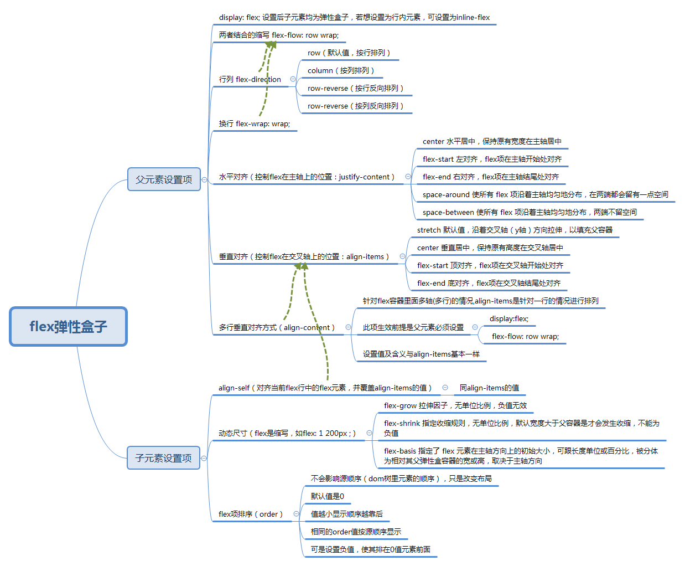

## 前言

感觉自己学习前端这两个月来，基础知识基本都涉及了，学的时候也都能理解，但是有个问题就是总记不住容易忘，于是决定接下来要开始进行一些知识点的梳理，建立自己的知识体系，今天用思维导图简单梳理了 一下flex弹性盒子的基本用法，发现用思维导图系统记忆的方法明显比想不起来再回头看大段文字的知识点和文档要更好一些，于是决定以后都在博客中记录下自己的知识梳理总结，便于以后查找回顾。

## flex弹性盒子简介

长久以来，唯一可用的且有稳定的跨浏览器兼容性的能用来构建 CSS 布局的工具只有 floats 和 positioning。它们是既可行，表现也不错的布局方案，但是在某些布局方面它们就有限制，并且难以实现。

以下简单的布局要求是难以或不可能用这样的工具（ floats 和 positioning）方便且灵活的实现的：

- 在父内容里面垂直居中一个块内容。
- 使容器的所有子项占用等量的可用宽度/高度，而不管有多少宽度/高度可用。
- 使多列布局中的所有列采用相同的高度，即使它们包含的内容量不同。

CSS3在布局方面做了非常大的改进，加入了flex弹性盒子，使得我们对块级元素的布局排列变得十分灵活，适应性非常强，其强大的伸缩性，在响应式开中可以发挥极大的作用。

## flex模型说明

当元素表现为 flex 框时，它们沿着两个轴来布局： 

- **主轴（main axis）**是沿着 flex 元素放置的方向延伸的轴（比如页面上的横向的行、纵向的列）。默认是水平方向。该轴的开始和结束被称为 **main start** 和 **main end**。
- **交叉轴（cross axis）**是垂直于 flex 元素放置方向的轴。默认是垂直方向。该轴的开始和结束被称为 **cross start** 和 **cross end**。
- 设置了 `display: flex` 的父元素被称之为 **flex 容器（flex container）。**
- 在 flex 容器中表现为柔性的盒子的元素被称之为 **flex 项**（**flex item**）。
- **方向**：默认主轴从左向右，侧轴默认从上到下。
- 主轴和侧轴并不是固定不变的，通过flex-direction可以互换。

## 思维导图

参考了一些资料将flex常用的一些属性和值梳理成如下思维导图，自己感觉这样梳理一下，建立联系，理清关系，更有利于记忆和使用。

**注：**

- 方向均是按照默认方向总结的。
- 若有需要原图或者xmind源文件的可访问我的github，在右侧栏有入口，或联系我。

**参考资料**

[弹性盒子 MDN](https://developer.mozilla.org/zh-CN/docs/Learn/CSS/CSS_layout/Flexbox)

