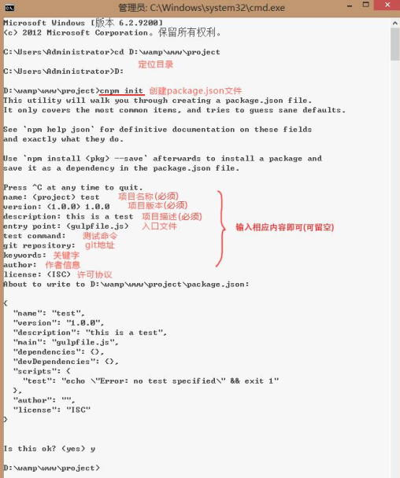

npm（node package manager）nodejs 的包管理器，用于 node 插件管理 （包括安装、卸载、管理依赖等）。

其能解决NodeJS代码部署上的很多问题，常见的使用场景有以下几种： 

- 允许用户从NPM服务器下载别人编写的第三方包到本地使用。
- 允许用户从NPM服务器下载并安装别人编写的命令行程序到本地使用。
- 允许用户将自己编写的包或命令行程序上传到NPM服务器供别人使用。

## npm安装升级

由于新版的nodejs已经集成了npm，所以之前npm也一并安装好了。同样可以通过输入 **"npm -v"** 来测试是否成功安装。命令如下，出现版本提示表示安装成功。

如果你安装的是旧版本的 npm，可以很容易得通过 npm 命令来升级，命令如下： 

~~~
npm install npm -g //（Window 系统）
$ sudo npm install npm -g //(Mac)
/usr/local/bin/npm -> /usr/local/lib/node_modules/npm/bin/npm-cli.js
npm@2.14.2 /usr/local/lib/node_modules/npm
~~~

## 使用 npm 安装插件    

命令提示符执行` npm install <name> [-g][--save-dev]`；    

其中：

- `<name>`：node 插件名称。例：npm install gulp-less --save-dev    
- -g：全局安装。将会安装在 C:\Users\Administrator\AppData\Roaming\npm， 并且写入系统环境变量； 非全局安装：将会安装在当前定位目录； 全局安装可以通过 命令行在任何地方调用它，本地安装将安装在定位目录的 node_modules 文件夹下，通过require()调用；本地安装时后面不用加-g。
- --save：将保存配置信息至 package.json（package.json 是 nodejs 项目配置文件）；  
- -dev：保存至 package.json 的 devDependencies 节点，不指定-dev 将保存至 dependencies 节点；一般像 express/ejs/body-parser等等保存在dependencies 。
- 为什么要保存至 package.json？因为 node 插件包相对来说非常庞大，所以不加入版本管理，将配置信息写入 package.json 并将其加入版本管理，其他开发者对应下载 即可（命令提示符执行 npm install，则会根据 package.json 下载所有需要的包，npm install --production 只下载 dependencies 节点的包）。   
- 安装后可使用 `npm list -g`命令来查看所有全局安装的模块，如果要查看某个模块的版本号，可以使用命令 `npm list <name>`

## 使用 package.json

package.json 位于模块的目录下，用于定义包的属性。

说明：package.json 是基于 nodejs 项目必不可少的配置文件，它是存放在项目根目 录的普通 json 文件；    

它是这样一个 json 文件（注意：json 文件内是不能写注释的）：    

```
{
"name": "express",
  "description": "Fast, unopinionated, minimalist web framework",
  "version": "4.13.3",
  "author": {
    "name": "TJ Holowaychuk",
    "email": "tj@vision-media.ca"
  },
  "contributors": [
    {
      "name": "Aaron Heckmann",
      "email": "aaron.heckmann+github@gmail.com"
    },
    {
      "name": "Ciaran Jessup",
      "email": "ciaranj@gmail.com"
    },
  ],
  "license": "MIT",
  "repository": {
    "type": "git",
    "url": "git+https://github.com/strongloop/express.git"
  },
  "homepage": "http://expressjs.com/",
  "keywords": [
    "express",
    "framework",
    "sinatra",
    "web",
  ],
  "dependencies": {
    "accepts": "~1.2.12",
    "array-flatten": "1.1.1",
    "content-disposition": "0.5.0",
    "content-type": "~1.0.1",
    "cookie": "0.1.3",
  },
  "devDependencies": {
    "after": "0.8.1",
    "ejs": "2.3.3",
  },
  "engines": {
    "node": ">= 0.10.0"
  },
  "files": [
    "LICENSE",
    "History.md",
    "Readme.md",
    "index.js",
    "lib/"
  ],
  "scripts": {
    "test": "mocha --require test/support/env --reporter spec --bail --check-leaks test/ test/acceptance/",
    "test-ci": "istanbul cover node_modules/mocha/bin/_mocha --report lcovonly -- --require test/support/env --reporter spec --check-leaks test/ test/acceptance/",
    "test-cov": "istanbul cover node_modules/mocha/bin/_mocha -- --require test/support/env --reporter dot --check-leaks test/ test/acceptance/",
    "test-tap": "mocha --require test/support/env --reporter tap --check-leaks test/ test/acceptance/"
  },
  "gitHead": "ef7ad681b245fba023843ce94f6bcb8e275bbb8e",
  "bugs": {
    "url": "https://github.com/strongloop/express/issues"
  },
  "_id": "express@4.13.3",
  "_shasum": "ddb2f1fb4502bf33598d2b032b037960ca6c80a3",
  "_from": "express@*",
  "_npmVersion": "1.4.28",
  "_npmUser": {
    "name": "dougwilson",
    "email": "doug@somethingdoug.com"
  },
  "maintainers": [
    {
      "name": "tjholowaychuk",
      "email": "tj@vision-media.ca"
    },
    {
      "name": "jongleberry",
      "email": "jonathanrichardong@gmail.com"
    },
  ],
  "dist": {
    "shasum": "ddb2f1fb4502bf33598d2b032b037960ca6c80a3",
    "tarball": "http://registry.npmjs.org/express/-/express-4.13.3.tgz"
  },
  "directories": {},
  "_resolved": "https://registry.npmjs.org/express/-/express-4.13.3.tgz",
  "readme": "ERROR: No README data found!"
}
```

我们可以通过在命令提示符执行 `cnpm init  `生成package.json文件。



查看 package.json 帮助文档，可在命令行执行 cnpm help package.json。


### Package.json 属性说明

- **name** - 包名。
- **version** - 包的版本号。
- **description** - 包的描述。
- **homepage** - 包的官网 url 。
- **author** - 包的作者姓名。
- **contributors** - 包的其他贡献者姓名。
- **dependencies** - 依赖包列表。如果依赖包没有安装，npm 会自动将依赖包安装在 node_module 目录下。
- **repository** - 包代码存放的地方的类型，可以是 git 或 svn，git 可在 Github 上。
- **main** - main 字段指定了程序的主入口文件，require('moduleName') 就会加载这个文件。这个字段的默认值是模块根目录下面的 index.js。
- **keywords** - 关键字

## 创建模块

创建模块，package.json 文件是必不可少的。我们可以使用 NPM 生成 package.json 文件，生成的文件包含了基本的结果。 

~~~
$ npm init
This utility will walk you through creating a package.json file.
It only covers the most common items, and tries to guess sensible defaults.

See `npm help json` for definitive documentation on these fields
and exactly what they do.

Use `npm install <pkg> --save` afterwards to install a package and
save it as a dependency in the package.json file.

Press ^C at any time to quit.
name: (node_modules) runoob                   # 模块名
version: (1.0.0) 
description: Node.js 测试模块(www.runoob.com)  # 描述
entry point: (index.js) 
test command: make test
git repository: https://github.com/runoob/runoob.git  # Github 地址
keywords: 
author: 
license: (ISC) 
About to write to ……/node_modules/package.json:      # 生成地址

{
  "name": "runoob",
  "version": "1.0.0",
  "description": "Node.js 测试模块(www.runoob.com)",
  ……
}


Is this ok? (yes) yes
~~~

以上的信息，你需要根据你自己的情况输入。在最后输入 "yes" 后会生成 package.json 文件。

接下来我们可以使用以下命令在 npm 资源库中注册用户（使用邮箱注册）：

~~~
$ npm adduser
Username: mcmohd
Password:
Email: (this IS public) mcmohd@gmail.com
~~~

接下来我们就用`$ npm publish`命令来发布模块。

如果你以上的步骤都操作正确，你就可以跟其他模块一样使用 npm 来安装。 

## npm常用命令

- 使用 npm 卸载插件：npm uninstall `<name> [-g][--save-dev]， `注意：不要直接删除本地插件包 
  - 删除全部插件：npm uninstall gulp-less gulp-uglify gulp-concat    
  - 借助 rimraf：npm install rimraf -g 用法：rimraf node_modules    
  - 卸载后，你可以到 /node_modules/ 目录下查看包是否还存在，或者使用`npm ls`命令查看
- 搜索插件：`npm search <name>`

- 使用 npm 更新插件：`npm update <name> [-g][--save-dev]    `
  - 更新全部插件：`npm update [--save-dev] `
- 查看 npm 帮助：npm help   
  - 使用`npm help <command>`可查看某条命令的详细帮助，例如`npm help install`。 
- 查看当前目录已安装插件：npm list    
- 在`package.json`所在目录下使用`npm install . -g`可先在本地安装当前命令行程序，可用于发布前的本地测试。 
  - 使用`npm update <package>`可以把当前目录下`node_modules`子目录里边的对应模块更新至最新版本。 
  - 使用`npm update <package> -g`可以把全局安装的对应命令行程序更新至最新版。 
- 使用`npm cache clear`可以清空NPM本地缓存，用于对付使用相同版本号发布新版本代码的人。 
- 使用`npm unpublish <package>@<version>`可以撤销发布自己发布过的某个版本代码。 

## 版本号

使用NPM下载和发布代码时都会接触到版本号。NPM使用语义版本号来管理代码，这里简单介绍一下。

语义版本号分为X.Y.Z三位，分别代表主版本号、次版本号和补丁版本号。当代码变更时，版本号按以下原则更新。

- 如果只是修复bug，需要更新Z位。
- 如果是新增了功能，但是向下兼容，需要更新Y位。
- 如果有大变动，向下不兼容，需要更新X位。

版本号有了这个保证后，在申明第三方包依赖时，除了可依赖于一个固定版本号外，还可依赖于某个范围的版本号。例如"argv": "0.0.x"表示依赖于0.0.x系列的最新版argv。

NPM支持的所有版本号范围指定方式可以查看[官方文档](https://npmjs.org/doc/files/package.json.html#dependencies)。

## 使用淘宝 NPM 镜像

因为 npm 安装插件是从国外服务器下载，受网络影响大，可能出现异常，这里推荐使用淘宝 NPM 镜像。 

淘宝 NPM 镜像是一个完整 npmjs.org 镜像，你可以用此代替官方版本(只读)，同步频率目前为 10分钟 一次以保证尽量与官方服务同步。

你可以使用淘宝定制的 cnpm (gzip 压缩支持) 命令行工具代替默认的 npm:

~~~
$ npm install -g cnpm --registry=https://registry.npm.taobao.org
~~~

这样就可以使用 cnpm 命令来安装模块了： 

```
$ cnpm install [name]
```

注意：安装完后最好查看其版本号 cnpm -v 或关闭命令提示符重新打开，安装完直接使用 有可能会出现错误；    

注：cnpm 跟 npm 用法完全一致，只是在执行命令时将 npm 改为 cnpm。    

更多信息可以查阅：<http://npm.taobao.org/>。 

参考链接：

[NPM 使用介绍 菜鸟教程](http://www.runoob.com/nodejs/nodejs-npm.html)


