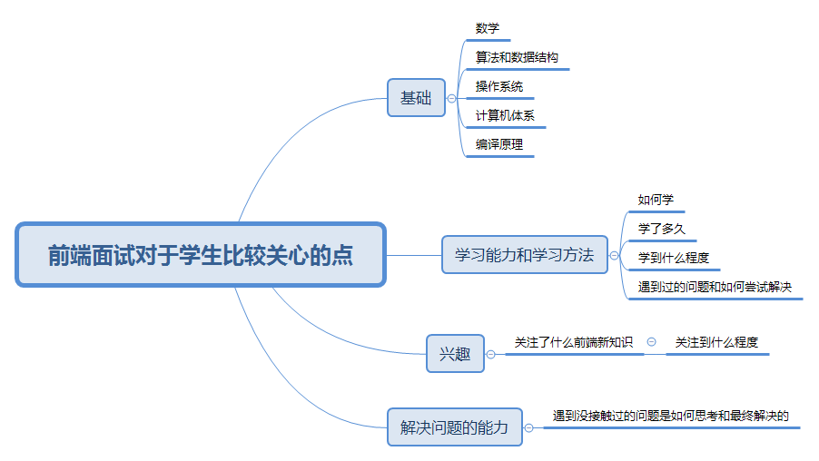
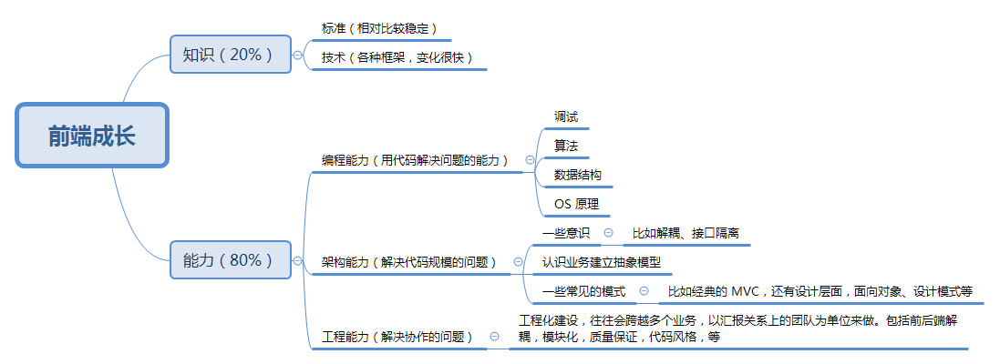
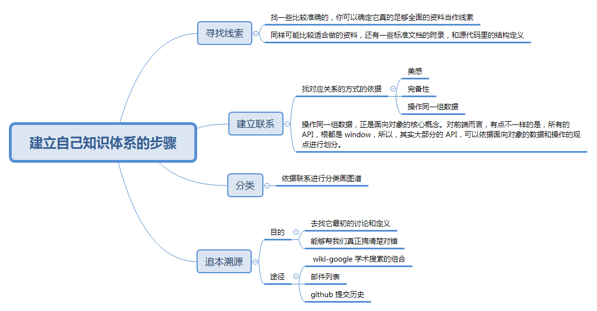
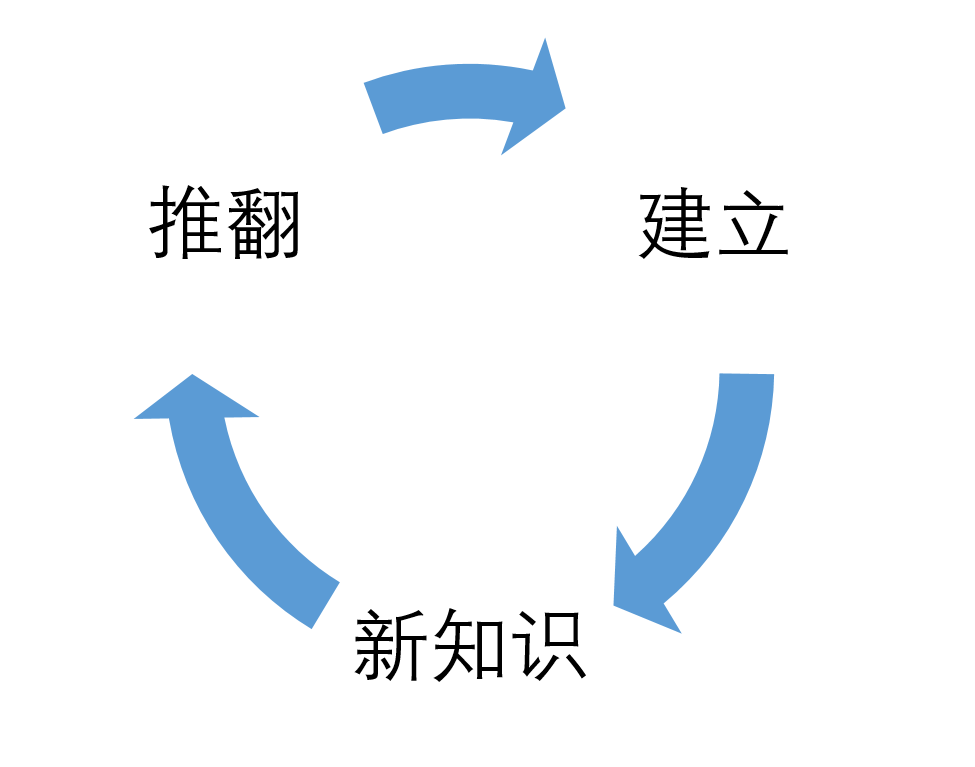
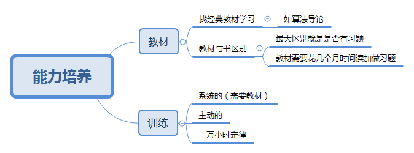

### 前言

断断续续的自学前端已经有两个多月了，一直在思考我要学到什么程度才能去找实习或者是直接参加校准，公司招学生主要是看中什么能力。之前会一直关注各公司招聘初级前端或者招聘前端实习生的招聘要求，基本都是：

- 要熟练掌握html，css，javascript；
- jquery，bootstrap，less，sass
- 扎实的计算机基础，较强编程能力；
- 能够熟练掌握至少一种前端框架，vue，react，angular等；
- 熟悉前端工程化工具，如gulp，webpack等；
- 最好会一门后端编程语言，如php，java，nodejs等
- 最好有项目经验

感觉要学完这些，达到招聘要求真的需要花费很多时间，而我一方面是非科班学生，虽然以前算是个学霸，但毕竟专业完全不相干，所以可以说是完全从零基础学习；另一方面，已经是研二下学期，下半年八九月份马上秋招了，秋招招聘提供岗位更多，希望可以在秋招的时候找到相关工作，这就要求必须能够明确公司招聘对学生主要看中什么方面的能力，如何能够针对性的学习了。之前其实自己以为我似乎必须得按照大多数招聘要求，必须学完前面上面列举的相关知识，然后再自己找些项目做，后来又在思考这样学习是不是不对，直到我这两天看到了奇舞团博客和淘宝FED博客上写关于前端成长的建议，我才更加确定的知道什么是最重要，最该好好学习的，现将这两篇博客的主要内容总结如下，也方便自己以后自己复习查看。

### 写给想成为前端工程师的同学们

以下是奇舞团博客[写给想成为前端工程师的同学们](https://75team.com/post/to-be-a-good-frontend-engineer.html)中摘取的部分内容：

**前端工程师是做什么的？**

狭义上讲：前端工程师使用 HTML、CSS、JavaScript 等专业技能和工具将产品UI设计稿实现成网站产品，涵盖用户PC端、移动端网页，处理视觉和交互问题。 

广义上讲：所有用户终端产品与视觉和交互有关的部分，都是前端工程师的专业领域。 

**前端工程师的发展之路和前景是怎么样的？**

前端是一个相对比较新的行业，互联网发展早期（1995年~2005年）是没有专业的前端工程师的。随着互联网的发展，大约从2005年开始，正式的前端工程师角色被行业认可，到了2010年，互联网开始全面进入移动时代，前端工程师的地位越来越重要，前端领域的技术发展也越来越快，各种新的思想、设计模式、工具和平台都快速发展，对前端工程师的技能要求也越来越高。 

**前端工程师的学习和成长**

前端工程师首先是软件工程师，基础是最重要的，如果基础不扎实，一切应用技能就都是“浮云”。前端的基础是什么？HTML、CSS、JavaScript基本功，数学、算法、数据结构、操作系统、编译原理基本功。 

**对在校生看中的能力**

- 不一定要求实际经验 
- 注重基础，学习能力、学习方法，兴趣以及解决问题的能力
- 建立上写自己真正擅长的内容 
- 学习技术的深度

> 面试是一个彼此交流的过程，我们希望看到大家在前端领域的能力和潜力，“知道”一件事，并不是一种有价值的能力，尤其是在知识廉价的互联网时代。我们的同学千万不要像背书一样去死记硬背一样东西，而应该真正用心去学。

自己总结画的思维导图如下：

### 一个前端的自我修养

接下来分享一下淘宝FED博客[一个前端的自我修养](http://taobaofed.org/blog/2016/03/23/the-growth-of-front-end/)中的部分内容：

> 关于成长，首先我得发一个免责声明，不是我对我讲的内容没有信心，而是成长是自己的事，英文有句话，在外企工作的人会经常听到，叫做：
>
> You are the owner of your career.
>
> 你是你职业发展的责任人。这句话潜台词是，你（不是你老板，也不是你爸妈，也不是你女朋友）是你职业发展的责任人。
>
 #### 前端成长

#### 知识的学习

对知识学习的目标：一曰准确，二曰全面。对知识学习，主张建立自己的体系，不要去相信书。 

建立自己知识体系的步骤 ：

这个建立知识体系的过程，是不断接受新知识，挑战、质疑原有的体系，推翻再重建，每一次循环，你的知识体系都变得更加坚固，更加强大。 

#### 能力的培养

对于能力的培养，总结画出的思维导图如下：

### 总结

- 对于前端学习，基础是重中之重，处于现阶段的我应该先打好基础，才能更好的学习其他技术栈；
- 发现很多理论和学习方法是通用的，比如：
  - 关教材和书的区别，记得以前上专业课时老师就说过，和这里说的一样；
  - 一万小时定律，是经常在樊登读书会听到的理论，也是萌姐《人生管理课》中重点强调的理论，这又和《刻意练习》这边书提到的理论相结合；
  - 提到建立自己的知识体系，和自己学习萌姐的《人生管理课》中知识管理中讲到建立自己的知识宫殿相关；
  - 以及提到的“建立-新知识-推翻”循环，与之前听樊登读书会讲到的一些正向良性循环，以及萌姐提到他的时间管理中的“计划-实施-总结-评估-再次计划”正向循环理论类似；

参考文章链接：

[写给想成为前端工程师的同学们](https://75team.com/post/to-be-a-good-frontend-engineer.html)

[一个前端的自我修养](http://taobaofed.org/blog/2016/03/23/the-growth-of-front-end/)

