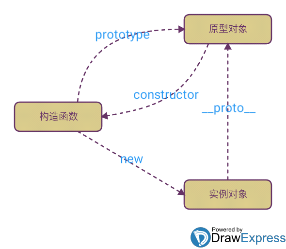

### 原型链理解图

复习原型链时看到比较好的几幅图，在此收藏一下。

表示原型对象，构造函数和实例对象的关系图：



原型链图1：


原型链图2：


### 对象的constuctor属性

返回创建实例对象的 [`Object`](https://developer.mozilla.org/zh-CN/docs/Web/JavaScript/Reference/Global_Objects/Object) 构造函数的引用。注意，此属性的值是对函数本身的引用，而不是一个包含函数名称的字符串。对原始类型来说，如`1`，`true`和`"test"`，该值只可读。

所有对象都会从它的原型上继承一个 `constructor` 属性。

依赖一个对象的 `constructor` 属性并不安全。

大多数情况下，此属性用于定义一个构造函数，并使用**new**和继承原型链进一步调用它。

```js
function Parent() {}
Parent.prototype.parentMethod = function parentMethod() {};

function Child() {}
Child.prototype = Object.create(Parent.prototype); // re-define child prototype to Parent prototype

Child.prototype.constructor = Child; // return original constructor to Child
```

手动设置或更新构造函数可能会导致不同且有时令人困惑的后果。为了防止它，只需在每个特定情况下定义构造函数的角色。在大多数情况下，不使用构造函数，并且不需要重新分配构造函数。


### instanceof运算符

`instanceof` **运算符**用来测试一个对象在其原型链中是否存在一个构造函数的 `prototype` 属性。

**语法**： `object instanceof constructor`

**参数**：object-要检测的对象；constructor-某个构造函数

**描述**：`instanceof `运算符用来检测 `constructor.prototype `是否存在于参数 `object` 的原型链上。


### Objet.create()

**Object.create()**方法创建一个新对象，使用现有的对象来提供新创建的对象的__proto__。 

**语法**：

```html
Object.create(proto, [propertiesObject])
```

**参数**：

proto    新创建对象的原型对象。

propertiesObject   可选。如果没有指定为 `undefined`，则是要添加到新创建对象的可枚举属性（即其自身定义的属性，而不是其原型链上的枚举属性）对象的属性描述符以及相应的属性名称。这些属性对应[`Object.defineProperties()`](https://developer.mozilla.org/zh-CN/docs/Web/JavaScript/Reference/Global_Objects/Object/defineProperties)的第二个参数。

**返回值**：一个新对象，带着指定的原型对象和属性。

如果`propertiesObject`参数不是 `null`或一个对象，则抛出一个 `TypeError`异常。


**Object.create()**相当于:

```
function create(o){
  function F(){}
  F.prototype = o;
  return new F();
}
```

在 object()函数内部，先创建了一个临时性的构造函数，然后将传入的对象作为这个构造函数的 原型，最后返回了这个临时类型的一个新实例。  从本质上讲， object()对传入其中的对象执行了一次 浅复制。在传入一个参数的情况下， Object.create()与 object()方法的行为相同。    


#### 例子

##### 用 `Object.create`实现类式继承

下面的例子演示了如何使用`Object.create()`来实现类式继承。这是一个所有版本JavaScript都支持的单继承。

```js
// Shape - 父类(superclass)
function Shape() {
  this.x = 0;
  this.y = 0;
}

// 父类的方法
Shape.prototype.move = function(x, y) {
  this.x += x;
  this.y += y;
  console.info('Shape moved.');
};

// Rectangle - 子类(subclass)
function Rectangle() {
  Shape.call(this); // call super constructor.
}

// 子类续承父类
Rectangle.prototype = Object.create(Shape.prototype);
Rectangle.prototype.constructor = Rectangle;

var rect = new Rectangle();

console.log('Is rect an instance of Rectangle?',
  rect instanceof Rectangle); // true
console.log('Is rect an instance of Shape?',
  rect instanceof Shape); // true
rect.move(1, 1); // Outputs, 'Shape moved.'
```

如果你希望能继承到多个对象，则可以使用混入的方式。

```js
function MyClass() {
     SuperClass.call(this);
     OtherSuperClass.call(this);
}

// 继承一个类
MyClass.prototype = Object.create(SuperClass.prototype);
// 混合其它
Object.assign(MyClass.prototype, OtherSuperClass.prototype);
// 重新指定constructor
MyClass.prototype.constructor = MyClass;

MyClass.prototype.myMethod = function() {
     // do a thing
};
```

[Object.assign](https://developer.mozilla.org/zh-CN/docs/Web/JavaScript/Reference/Global_Objects/Object/assign) 会把  `OtherSuperClass`原型上的函数拷贝到 `MyClass`原型上，使 MyClass 的所有实例都可用 OtherSuperClass 的方法。Object.assign 是在 ES2015 引入的，且可用[ polyfilled](https://developer.mozilla.org/zh-CN/docs/Web/JavaScript/Reference/Global_Objects/Object/assign#Polyfill)。要支持旧浏览器的话，可用使用 [jQuery.extend()](https://api.jquery.com/jQuery.extend/) 或者 [_.assign()](https://lodash.com/docs/#assign)。

##### 使用 `Object.create` 的 `propertyObject`参数

```js
var o;

// 创建一个原型为null的空对象
o = Object.create(null);


o = {};
// 以字面量方式创建的空对象就相当于:
o = Object.create(Object.prototype);


o = Object.create(Object.prototype, {
  // foo会成为所创建对象的数据属性
  foo: { 
    writable:true,
    configurable:true,
    value: "hello" 
  },
  // bar会成为所创建对象的访问器属性
  bar: {
    configurable: false,
    get: function() { return 10 },
    set: function(value) {
      console.log("Setting `o.bar` to", value);
    }
  }
});


function Constructor(){}
o = new Constructor();
// 上面的一句就相当于:
o = Object.create(Constructor.prototype);
// 当然,如果在Constructor函数中有一些初始化代码,Object.create不能执行那些代码


// 创建一个以另一个空对象为原型,且拥有一个属性p的对象
o = Object.create({}, { p: { value: 42 } })

// 省略了的属性特性默认为false,所以属性p是不可写,不可枚举,不可配置的:
o.p = 24
o.p
//42

o.q = 12
for (var prop in o) {
   console.log(prop)
}
//"q"

delete o.p
//false

//创建一个可写的,可枚举的,可配置的属性p
o2 = Object.create({}, {
  p: {
    value: 42, 
    writable: true,
    enumerable: true,
    configurable: true 
  } 
});
```


参考链接：

[关于原型链，实例对象，原型，构造函数之间的关系理解](https://segmentfault.com/q/1010000005182807)

https://segmentfault.com/q/1010000005182807   

[从 `__proto__ `prototype 说起](http://varnull.cn/cong-__proto__-prototype-shuo-qi/)

[instanceof -mdn](https://developer.mozilla.org/zh-CN/docs/Web/JavaScript/Reference/Operators/instanceof)

[constructor -mdn](https://developer.mozilla.org/zh-CN/docs/Web/JavaScript/Reference/Global_Objects/Object/constructor)

[Objet.create()-mdn](https://developer.mozilla.org/zh-CN/docs/Web/JavaScript/Reference/Global_Objects/Object/create)

js高级程序设计

